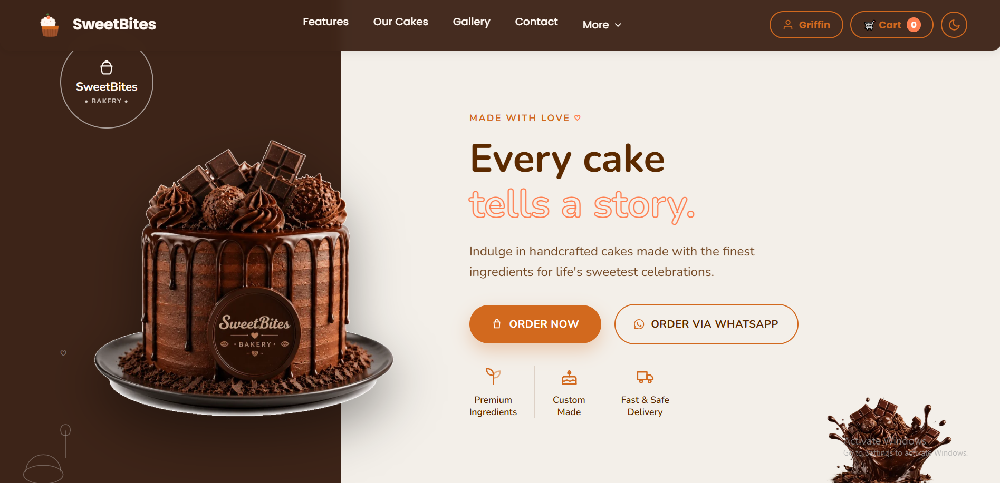
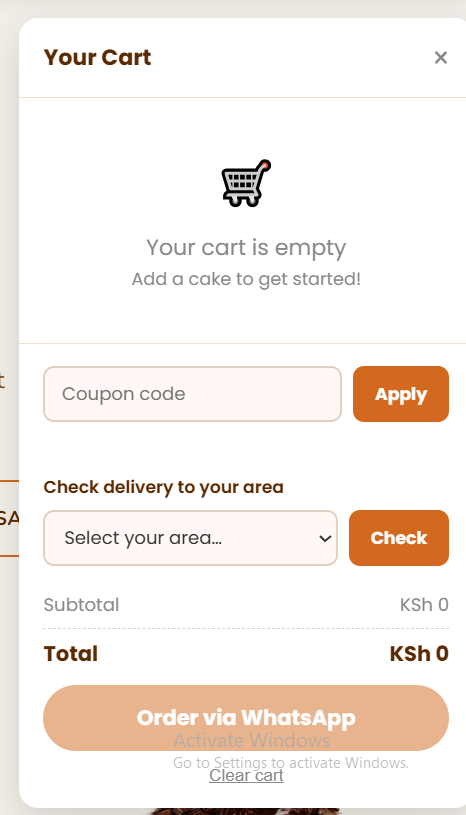
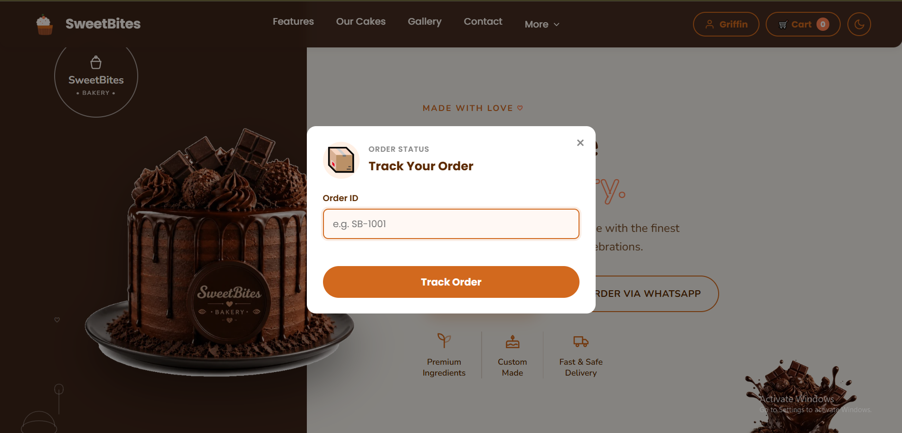

The frontend is a static site with no build step, deployed on GitHub Pages. It talks to a separate Node/Express API over HTTPS. There's no server-rendering — all pages are plain HTML/CSS/vanilla JS, with the API handling all persistence and business logic.

## Tech Stack

| Layer | Choice |
|---|---|
| Frontend | HTML5, CSS3, vanilla JavaScript (no framework) |
| Backend | Node.js, Express |
| Database | PostgreSQL |
| Auth | JWT (jsonwebtoken), bcrypt for password hashing |
| Validation | express-validator |
| Rate limiting | express-rate-limit |
| Hosting | GitHub Pages (frontend), Render (API + Postgres) |

## Authentication

- Passwords are hashed with bcrypt before storage — never stored or logged in plain text.
- Login issues a signed JWT (HS256, explicit algorithm pinned to prevent algorithm-confusion attacks), stored client-side and sent as a Bearer token.
- Guest checkout is intentional: placing an order never requires an account. Login is only for returning customers and admins.
- Admin routes check the role from the database on every request (`requireAdmin` middleware) — not from a client-supplied claim — so a tampered token or edited localStorage value can't grant admin access.

## Database

PostgreSQL, with tables for `users`, `cakes`, `orders`, and `contact_messages`. Orders store a snapshot of the cake name and price at order time (not just a foreign key), so a later menu price change never rewrites a customer's historical order.

## API

REST API, JSON over HTTPS. Key endpoints:

| Method | Endpoint | Auth | Purpose |
|---|---|---|---|
| GET | `/api/cakes` | none | List available cakes |
| POST | `/api/orders` | optional | Place an order (guest or logged-in) |
| GET | `/api/orders/:orderNumber` | none | Track an order — returns only cake name, status, delivery date (no personal data, since order numbers are guessable) |
| GET | `/api/orders` | admin | List all orders |
| PATCH | `/api/orders/:orderNumber/status` | admin | Update order status |
| POST | `/api/auth/register`, `/login` | none | Account creation / login |
| POST | `/api/contact` | none | Contact form |

Validation (date ranges, phone/name length limits matching DB columns, cake availability) happens server-side via `express-validator`, so the API never trusts client-supplied data — even though the frontend validates the same rules for instant feedback.

## Admin Dashboard

A separate page (`dashboard.html`) for logged-in admins: view all orders, change status, and manage the cake catalog. Protected both by frontend route-gating and by the backend checking the account's role on every request.

## Deployment

- **Frontend:** GitHub Pages, auto-deployed on push to `main`.
- **Backend:** Render (free tier — the API may take 30–60 seconds to wake up after inactivity).
- **Database:** Render PostgreSQL.
- Environment variables (`JWT_SECRET`, `CORS_ORIGIN`, `DATABASE_URL`) are set in Render's dashboard, never committed to the repo.

## Local Setup

Requires Node.js and a local or hosted PostgreSQL database.

**1. Clone and install**
```bash
git clone https://github.com/Griffin-Lugahi/SweetBites-APP.git
cd SweetBites-APP/sweetbite-api
npm install
```

**2. Configure environment variables**
```bash
cp .env.example .env
```
Then fill in `.env`:
- `DATABASE_URL` — your Postgres connection string
- `JWT_SECRET` — generate one with:
```bash
  node -e "console.log(require('crypto').randomBytes(48).toString('hex'))"
```
- `CORS_ORIGIN` — e.g. `http://localhost:5500` for local frontend testing

**3. Set up the database**
```bash
npm run db:migrate   # creates tables from db/schema.sql
npm run db:seed      # (optional) adds sample cakes
```

**4. Run the API**
```bash
npm run dev   # starts the server with auto-reload
```
The API runs on `http://localhost:4000` by default (or whatever `PORT` you set).

**5. Run the frontend**

The frontend (`index.html`, `script.js`, `index.css`) needs no build step — it's static. Open it with any local server (e.g. VS Code's Live Server extension, or `npx serve`), and make sure `API_BASE` in `script.js` points to your local API (`http://localhost:4000/api`) instead of the deployed Render URL.

> **Note:** check `package.json` in `sweetbite-api` for the exact script names (`npm run dev`, `db:migrate`, etc.) — adjust the commands above if yours differ.

## Screenshots





## Challenges

- **Keeping client-side and server-side validation in sync.** The frontend validates instantly for UX, but every rule (date ranges, field lengths, cake availability) is re-checked server-side, since client-side checks can be bypassed entirely.
- **Mobile header layout.** Fitting the logo, cart button, and menu into a header that works across very different phone screen widths took several iterations — the fix ended up being letting elements shrink naturally (`flex-shrink`, `min-width: 0`) rather than guessing a single "mobile" breakpoint.
- **Order privacy vs. convenience.** Order numbers are sequential and guessable, so the public tracking endpoint deliberately returns only non-personal fields (cake, status, date) — full details are only returned to whoever just placed the order, or to an admin.

## Future Improvements

- Real payment integration (M-Pesa Daraja API) instead of WhatsApp confirmation
- Email notifications on order status change
- Order history for logged-in customers
- Image upload for admin-managed cakes instead of external URLs

---

> Made with ❤️ and butter in Nairobi 🇰🇪